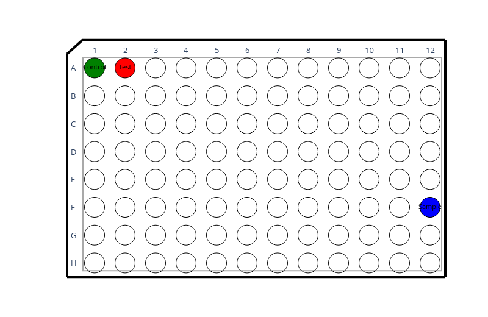
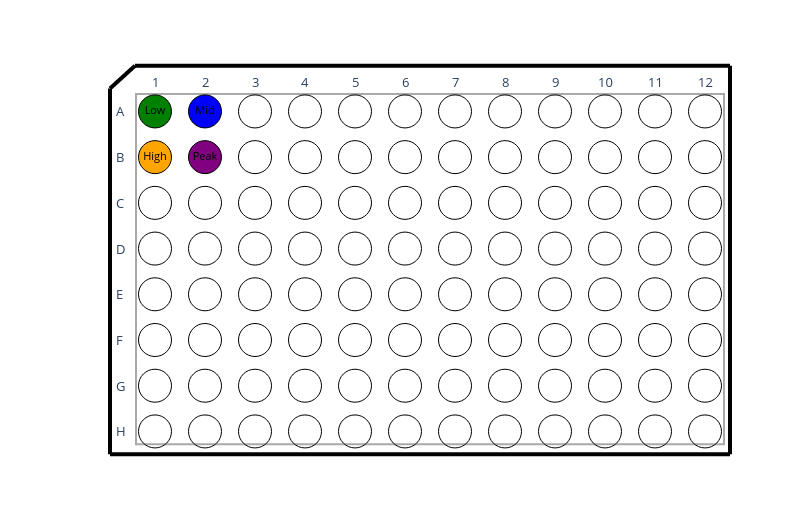
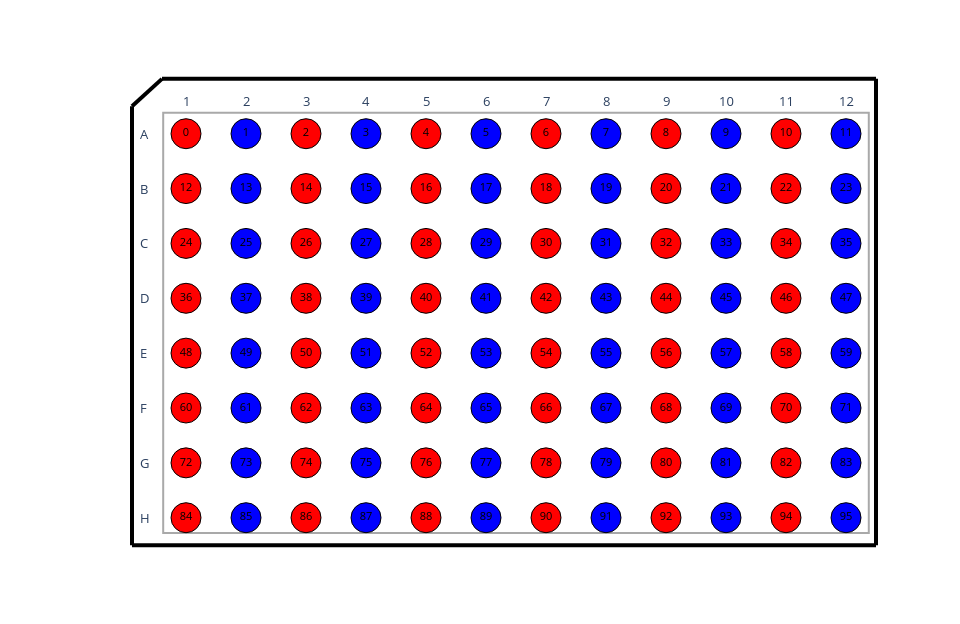
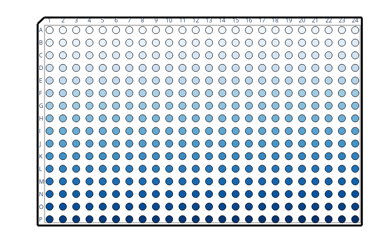
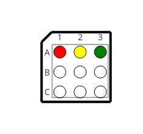
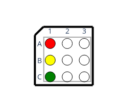

# `Plate` – Visualize Microplate Layouts with Plotly

The `Plate` class provides a flexible, intuitive, and customizable way to visualize microplate data (e.g., 96-well, 384-well) using [Plotly](https://plotly.com/python/). It supports arbitrary row labels (`A-Z`, `AA`, `AB`, ...) and optional color, value, and text overlays.

---

## 📦 Features

- Generate well-labeled plate maps from raw lists, dictionaries, or DataFrames
- Customize marker color, size, and hover tooltips
- Automatically infer and validate well names (e.g., `A1`, `B12`, `AA02`)
- Supports `horizontal` or `vertical` fill logic
- Output interactive Plotly figures directly from plate layouts

---

## 📋 Installation

```bash
pip install plotly_plate
```

---

## 🔧 Usage Examples

### 1. Create a Plate from a Dictionary

```python
from plotly_plate import Plate

well_dict = {
    "A1": {"value": 0.1, "color": "green", "text": "Control"},
    "A2": {"value": 0.5, "color": "red", "text": "Test"},
    "F12": {"value": 0.9, "color": "blue", "text": "Sample"}  # Two-letter rows supported
}

plate = Plate.from_dict(well_dict, n_rows=8, n_columns=12)
fig = plate.plot()
fig.show()
```



---

### 2. Create a Plate from a DataFrame

```python
import pandas as pd
from plotly_plate import Plate

df = pd.DataFrame({
    # Representations with or without leading zeros in well-names, supported.
    "well": ["A1", "A02", "B01", "B2"], 
    "value": [0.1, 0.2, 0.3, 0.4],
    "color": ["green", "blue", "orange", "purple"],
    "text": ["Low", "Mid", "High", "Peak"]
})

plate = Plate.from_dataframe(df, n_rows=8, n_columns=12)
fig = plate.plot(showscale=True)
fig.show()
```



---

### 3. Create a Plate from Lists

```python
# Creating a 96-well plate (default)
from plotly_plate import Plate

values = list(range(96))
colors = ["red" if v % 2 == 0 else "blue" for v in values]
text = [f"{v}" for v in values]

plate = Plate(values=values, colors=colors, overlay_text=text)
fig = plate.plot(marker_size=30, scale=1.2)
fig.show()
```




```python
# Creating a 384-well plate: 
values = list(range(384))
plate = Plate(values, n_rows=16, n_columns=24) 
fig = plate.plot(scale=0.6, marker_size=15)
fig.show() 

```



---

## 🔄 Horizontal vs Vertical Fill

When using lists of `values`, `colors`, or `overlay_text`, you control the layout direction with the `fill_direction` parameter.

- `"horizontal"` (default): Values fill left-to-right, top-to-bottom  
  → Row-major ordering  
  → Common for plate readers and CSV exports

- `"vertical"`: Values fill top-to-bottom, left-to-right  
  → Column-major ordering  
  → Often used in liquid handling robots

### Example

```python
col = ["red", "yellow", "green"]

# Horizontal fill
horiz = Plate(
    values=[0, 1, 2], 
    colors=col,n_rows=3, 
    n_columns=3, 
    fill_direction="horizontal"
).plot(marker_size=20)

# Vertical fill
vert = Plate(
    values=[0, 1, 2], 
    colors=col,
    n_rows=3,
    n_columns=3, 
    fill_direction="vertical"
).plot(marker_size=20)
```

See figures below for visual comparison:

**Figure A**: Horizontal fill

```python
horiz.show()
```



- **Figure B**: Vertical fill 

```python
vert.show()
```



---

## 🛠️ Utility

### Convert a Plate to Dictionary Format

```python
plate = Plate(values=..., colors=..., overlay_text=...)
plate_dict = plate.to_dict()
```

Useful for serialization, export, or inspection.

---

## 🎨 Customization Options

All of these can be passed to `Plate.plot(...)`:

| Parameter         | Type      | Description                                                  |
|------------------|-----------|--------------------------------------------------------------|
| `scale`          | `float`   | Overall scale of the plot and layout                         |
| `marker_size`    | `int`     | Size of the well markers                                     |
| `text_size`      | `int`     | Font size of the overlaid text                               |
| `text_color`     | `str`     | Color of the overlay text (default `"black"`)               |
| `showscale`      | `bool`    | Show color scale if using numeric values (default `False`)  |

---

## 📝 Notes

- **Well name formatting**:
  - Well names must be strings like `"A1"`, `"B12"`, `"AA03"`, etc.
  - Leading zeros are allowed: `"A01"` is interpreted as `"A1"`.
  - Case-insensitive (e.g., `"a1"` is valid).
  - Well names with more than 2 letters (e.g., `"AAA1"`) are **not** supported.

- **Row limit**:
  - The maximum number of supported rows is **702**, corresponding to label `"ZZ"`.

- **Color input behavior**:
  - If `colors` is not provided, a default Plotly colorscale (`Blues`) is applied using `values`.
  - You may explicitly pass:
    - `rgba(R,G,B,A)` strings (e.g., `"rgba(255,0,0,0.8)"`)
    - Hex colors (e.g., `"#00FF00"`)
    - Named CSS colors (e.g., `"purple"`, `"lightgray"`)

---

## 📜 License

MIT License. Feel free to use and extend.
